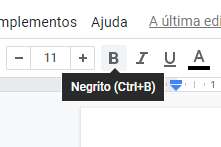
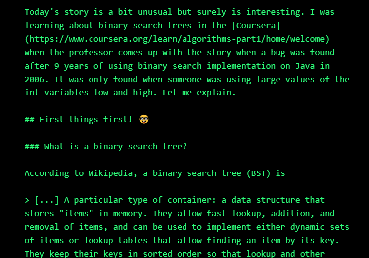
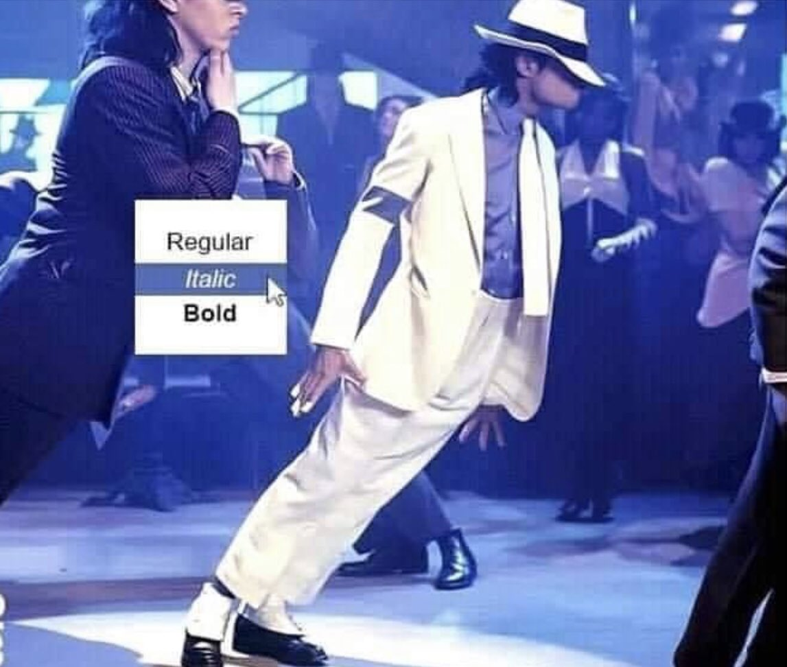

# Markdown LIVRO

# Sobre

Este livro irá abordar os fundamentos de edição de texto em *markdown editor* para que você possa tanto escrever ótimos READ.me's quanto ter uma melhor experiência editando textos!

Irei passar por diversos tópicos, estes sendo:

- O que é Markdown? Como funciona?
- Configuração do ambiente de edição.
- Sintaxe básica.
- Sintaxe avançada.
- Melhores Práticas

Ao ler este livro, você irá desenvolver um texto estilo wiki/READ.me junto comigo de forma a colocar em prática seus conhecimentos. Não só isso, mas iremos abordar também padrões e melhores práticas, assim você poderá sair como um mestre da documentação!

Vamos lá?

---

# Introdução

Olá! Seja bem vindo!

Me chamo Matheus Gomes e ocasionalmente escrevo abordando temas dos mais diversos assuntos. Utilizei diversas ferramentas durante esse período, porém a ferramenta que mais gostei foi o *markup* *markdown editor.* Eventualmente irei explicar sobre o *markup* e *markdown editor*, porém o que posso dizer agora é que o que me atrai bastante neste markup é que seu uso parece natural, não é necessário muita prática para sair escrevendo. Basta aprender uma dúzia de sintaxes que já é possível fazer um texto muito mais estilizado e coeso.

Se você tem costume de versionar seus projetos no Github é muito possível que já tenha utilizado Markdown, ou até que esteja lendo este livro com a idéia de aprender sobre a "Linguagem do Github".

Eu acredito que hoje não há um livro brasileiro sobre escrita com Markdown, apesar de estar tão inserido na comunidade de desenvolvedores e tão disseminado pelas empresas em suas documentações. É aquela "linguagem" que ninguém sabe ao certo como usa mas acaba usando toda semana. Portanto esse livro seria possivelmente o primeiro no país (sobre especificamente markdown), e o intuito é ser algo como um guia rápido e ao mesmo tempo um livro profundo e bem documentado sobre o Markdown.

Ademais, acredito que saber escrever com Markdown te proporciona uma perspectiva diferente sobre o documento, além de fornecer mais liberdade para o usuário poder estilizar o texto como bem entender de forma rápida e prática.

Acredito, assim como [Matt Cone](https://www.mattcone.com/) cita em seu livro "[The Markdown Guide](https://www.markdownguide.org/)", que o Markdown teve sucesso por ser o ponto de equilíbrio entre simplicidade e poder. Criado em 2004, milhões de pessoas tem utilizado ele para escrever desde notas até mesmo documentos. 

Outro ponto importante a ser mencionado é que este é minha primeira aventura em um livro, não só isso, mas um livro inteiramente escrito em Markdown utilizando diversos softwares de escrita que serão abordados mais a frente. Importante dizer que o livro que me motivou a escrever este foi o "The Markdown Guide" e a página de [John Gruber](https://daringfireball.net/projects/markdown/syntax) sobre o assunto. Teremos também um repositório no [github](https://github.com/matheusgomes062/guia-markdown) onde o livro estará disponível para fecharmos o ciclo de "um livro sobre markdown escrito em markdown e versionado no github".

Sem mais delongas, vamos lá, primeiramente...

---

# O que é Markdown? Como funciona?

Criado em 2004 por [John Gruber](https://daringfireball.net/projects/markdown/), Markdown é um linguagem de marcação de texto que adiciona elementos de [formatação em texto simples](https://www.markdownguide.org/getting-started/), sendo uma das linguagens de marcação mais utilizadas no mundo.

Não devemos confundir Markdown com [WYSIWYG](https://en.wikipedia.org/wiki/WYSIWYG) ou mesmo com algo como *Google Docs* ou *Word*. Isso porque programas como Word ou Google Docs, você clica em botões para mudar frases ou textos. Estas mudanças aparecem imediatamente e são diretamente relacionadas a estes botões. Diferente, o Markdown se baseia em um arquivo de texto formatado para indicar quais palavras e frases devem ser "estilizadas" de outra forma.

Por exemplo, em um documento, padrão Google Docs ou Word que utilizam WYSIWYG, caso  tenhamos o interesse de escrever um texto em negrito (*'bold' nos programas*), teria que clicar na opção de negrito (ou utilizar o comando `Ctrl+b`), em comparação, no Markdown, seria obtido o mesmo resultado adicionando asteriscos antes e após a palavra que se deseja por em negrito, ou seja:  `**esse texto está em negrito**` .

### Visualização

**esse texto está em negrito**

Assim, o  Markdown funciona utilizando de caracteres especiais que são postos antes e/ou depois de determinados blocos de texto para criar a estilização necessária!



Exemplo do Negrito em WYSIWYG



Exemplo de Markdown retirado do meu artigo no dev.to

## Mas e por debaixo dos panos?

Por debaixo dos panos o Markdown funciona da seguinte forma:

1. Escrevemos um texto em um arquivo `.md` ou `.markdown`
2. Este arquivo é então lido por um processador de Markdown. Isto é, o aplicativo que utilizaremos para ler ou editar utiliza esse processador para interpretar a linguagem que estamos escrevendo.
3. A aplicação Markdown então irá converter o arquivo Markdown em um documento HTML.
4. Exportando tal arquivo é possível analisar no browser ou até mesmo converter o arquivo para outro formato, como PDF.

O [Typora](https://typora.io/) por exemplo une os passos 1, 2 e 3, assim podemos visualizar a conversão em tempo real!

Apesar da diferença, você irá perceber logo mais a facilidade e rapidez que a marcação Markdown proporciona, basta continuar e acompanhar os exemplos!

> “Um dia encontrarei as palavras certas, e elas serão simples.”
-Jack Kerouac

---

# Por que utilizar markdown?

Como vimos anteriormente, temos algumas soluções para a marcação de textos com o WYSIWYG, assim, porque deveríamos aprender Markdown se esta solução já resolve?

Vamos listar os pontos do porque devemos aprender Markdown:

- **Markdown pode (e é) utilizado para tudo**. Pessoas utilizam Markdown para criar [sites](https://mkdocs.github.io/mkdocs-basic-theme/),  documentação, anotações, livros (como este), [apresentações](https://marp.app/), mensagens de email, documentação técnica e muito mais. O limite está na criatividade!
- **Markdown é portátil**. Arquivos escritos em Markdown podem ser abertos utilizando quase que qualquer aplicação. Se você não gostar do app que está utilizando para escrever em Markdown, você pode simplesmente importar o arquivo de texto atual para outro aplicativo que atenda melhor as suas necessidades. Eu por exemplo gosto muito de utilizar o [Typora](https://typora.io/), no entanto, eu atualmente tenho escrito no [Notion](https://www.notion.so/) pela praticidade e estilo. A questão é, independente da plataforma o Markdown é universal, ao contrário do documento Word ou Google docs que seguem padrões próprios e necessitam de aplicativos específicos.
- **Markdown é independente.** Qualquer dispositivo ou sistema operacional consegue 'rodar' marcação do tipo Markdown.
- **Markdown é consolidado.** Mesmo que sua aplicação de edição parar de funcionar no futuro, pelo Markdown ser consolidado ainda será possível ler o arquivo. Isto é de extrema importância para quando tratamos de livros, artigos acadêmicos ou   mesmo documentos importantes que precisam ser preservados.
- **Markdown está em todo lugar**. Como dito no primeiro tópico, além de utilizado para tudo, ele está em tudo. Funcionando tanto no [Reddit](https://www.reddit.com/) quanto no [Github](https://github.com/), encontramos o Markdown nas mais diversas plataformas web, sendo possivelmente a linguagem de marcação mais utilizada no mundo (depois do HTML, claro).

Mas vamos lá! 

Primeiramente iremos...

---

# Configurar o ambiente de edição

Para acompanhar o livro é importante que você utilize um editor de texto que suporte Markdown. Temos diversas opções disponíveis, tanto gratuitas quanto pagas. 

Aqui irei dispor algumas dessas opções:

- [Typora](https://typora.io/)
- [Dillinger](https://dillinger.io/)
- [GhostWriter](https://wereturtle.github.io/ghostwriter/)
- [Zettlr](https://www.zettlr.com/)
- [Notion](http://notion.so)
- [StackEdit](https://stackedit.io/)
- [editor.md](https://pandao.github.io/editor.md/en.html)

Neste livro utilizaremos o Typora por ser *open source* (no momento que escrevo o Typora é **open source**, mas eventualmente ele irá se tornar pago), ou seja, **é gratuito**. Ele também é uma aplicação para Windows, Mac (Beta) e Linux, ou seja, **podemos utilizar em qualquer lugar**. Por fim, escolho o Typora pela **ampla base de usuários**, **simplicidade**, e **leveza** e por ser **possível adicionar temas**!

Portanto, basta baixar e instalar o Typora, ou editor de preferência para podermos iniciar o curso!

> “Escrever é uma forma socialmente aceitável de esquizofrenia.”
― E.L. Doctorow

---

# Sintaxe Básica

Como o Markdown basicamente converte o que escrevemos para HTML, irei abordar o ensino da linguagem contrapondo e referenciando o HTML. Caso você não saiba sobre HTML, não tem problema, não é necessário saber HTML, mas fica mais fácil para entender caso você saiba sobre. De qualquer forma, esse livro não exige conhecimento prévio de programação!

A apresentação da linguagem será dada da seguinte forma:

### Markdown

```bash
1. Estou começando a gostar de escrever com Markdown
2.
3. Acho que irei usar isso daqui pra frente.
```

### HTML

```html
1. <p>Estou começando a gostar de escrever com Markdown</p>
2.
3. <p>Acho que irei usar isso daqui pra frente.</p>
```

### Visualização

Estou começando a gostar de escrever com Markdown

Acho que irei usar isso daqui pra frente.

Markdown será onde escreverei em markdown puro. HTML será onde será mostrado a conversão para HTML e a Visualização será onde veremos o texto que o usuário final vê!

Vamos lá.

---

## Títulos

Para títulos utilizamos a cerquilha (ou infamemente conhecida como jogo da velha) `#` . O título é medido pelo número de vezes que a cerquilha é posta em conjunto, ou seja,  utilizaremos duas cerquilhas para caso queiramos representar um título em `h2`, ou em termos leigos, um título um tanto menor que o título de maior tamanho.

Aqui está algo mais claro e prático:

| Markdown              | HTML                    |
| --------------------- | ----------------------- |
| # Título nível 1      | <h1>Título nível 1</h1> |
| ## Título nível 2     | <h2>Título nível 2</h2> |
| ### Título nível 3    | <h3>Título nível 3</h3> |
| #### Título nível 4   | <h4>Título nível 4</h4> |
| ##### Título nível 5  | <h5>Título nível 5</h5> |
| ###### Título nível 6 | <h6>Título nível 6</h6> |


### Sintaxe alternativa para Títulos

Existe uma sintaxe alternativa para títulos que é pouco usada. Tal sintaxe serve apenas para títulos de nível 1 e 2 (h1 e h2). Ela funciona da seguinte forma, colocamos o sinal de menos/subtração  (`-`) na linha abaixo do título para mostrar o título como título de nível 1. E utilizamos o  sinal  de igual (`=`) na linha abaixo do título para mostrar o título como título de nível 2.

Exemplificando:

| Markdown                 | HTML                    |
| ------------------------ | ----------------------- |
| Título nível 1 ========= | <h1>Título nível 1</h1> |
| Título nível 1 ——————    | <h2>Título nível 2</h2> |


### Melhores práticas para Títulos

As aplicações de markdown geralmente não concordam entre si sobre o espaço entre a cerquilha e o título. Para compatibilidade sempre utilize um espaço entre os dois.

Exemplo:

`# Título com espaço` ✔

`# Título sem espaço` ❌

---

## Parágrafos

Para criar parágrafos, utilizamos uma linha em branco para separar as linhas de texto.  Não devemos indentar os parágrafos com espaços ou *tabs,* pois isso irá representar outra função diferente do parágrafo.

Exemplo:

### Markdown

```bash
1. Estou começando a gostar de escrever com Markdown
2.
3. Acho que irei usar isso daqui pra frente.
```

### HTML

```html
1. <p>Estou começando a gostar de escrever com Markdown</p>
2.
3. <p>Acho que irei usar isso daqui pra frente.</p>
```

### Visualização

Estou começando a gostar de escrever com Markdown

Acho que irei usar isso daqui pra frente.


### Melhores práticas para Parágrafos

A não ser que o parágrafo esteja numa lista, não indente os parágrafos com espaços ou tabs.

`Não utilize tabs ou espaços na frente do seu parágrafos.` ✔

`Deixe as linhas alinhadas a esquerda assim.` ✔

    `Isso pode ocasionar problemas de formatação` ❌

 `E adicionar espaços no começo pode atrapalhar a leitura.` ❌

---

## Quebra de linha

A quebra de linha é bem simples, basta adicionar dois ou mais espaços no final de uma linha e então apertar enter (*return* no *mac*).

Exemplo:

### Markdown

```bash
1. Esta é a primeira linha.  
2. E esta é a segunda linha.
```

### HTML

```html
1. <p>Estou começando a gostar de escrever com Markdown<br />
2. E esta é a segunda linha.</p>
```

### Visualização

Esta é a primeira linha.
E esta é a segunda linha.


### Melhores prática para quebra de linha

Utilizar dois espaços para quebrar linhas pode ser usada em quase todas as aplicações, mas isso é relativamente controverso. Comumente é adicionado dois espaços sem querer no final das linhas. Por essa razão algumas pessoas gostam de utilizar outra opção para quebra de linha. Felizmente existe uma opção apoiada por algumas aplicações Markdown. Tal opção é o uso da tag <br> no final da linha.

Existem algumas aplicações que possibilitam o uso da barra invertida (`\`) para quebrar linhas, porém eu não posso recomendar seu uso, visto que:

1. Não são todas aplicações markdown que adotam essa funcionalidade.
2. Não é uma boa opção de compatibilidade.

E existem outras aplicações de Markdown que não necessitam de nada no final da linha, apenas apertar `Enter` quebra a linha.

Exemplo:

`Primeira linha com dois espaços depois.` ✔
`E sua próxima linha.`

---

`Primeira linha com uma barra invertida depois.\` ❌
`E sua próxima linha.`

---

`Linha com tag HTML de break row.<br>` ✔
`E sua próxima linha.`

---

`Linha sem nada depois, só um enter.` ✔

`E sua próxima linha.`

---

## Destaque/Ênfase

No caso, destaques para **negrito** e *itálico.*

### Negrito

Adicionar um texto em negrito exige dois asteriscos (`*`) antes e após o texto selecionado.

Da seguinte forma:

### Markdown

```bash
1. Vou dar ênfase **nisso**.
```

### HTML

```html
1. Vou dar ênfase <strong>nisso</strong>.
```

### Visualização

Vou dar ênfase **nisso.**

---

## Melhores práticas para Destaque - Negrito

Apesar de não haver concordância entre a melhor prática para o uso de negrito no meio de palavras, acredito que utilizar asteriscos é melhor do que utilizar sublinhados, pois aparenta ser mais legível e melhora a compatibilidade.

`Para**lele**pípedo.` ✔

`Para__lele__pípedo.` ❌


### Itálico

Para itálico utilizamos o mesmo conceito, porém ao invés de adicionar dois asteriscos utilizamos um sublinhado/underline **(`_`)*.*

Da seguinte forma:

### Markdown

```bash
1. Michael Jackson dançando fica estilo _itálico_.
```

### HTML

```html
1. Michael Jackson dançando fica estilo <em>itálico</em>.
```

### Visualização

1. Michael Jackson dançando fica estilo *itálico*.



### Melhores práticas para Destaque - Itálico

Apesar de não haver concordância entre a melhor prática para o uso de itálico no meio de palavras, acredito que utilizar asteriscos é melhor do que utilizar sublinhados, pois, como dito anteriormente pois aparenta ser mais legível e melhora a compatibilidade.

`Bor*bo*leta.` ✔

`Bor_bo_leta.` ❌

---

## Destaque com sintaxe alternativa

Existe uma outra forma, talvez menos usual de produzir os mesmos destaques. Vejamos como...


### Negrito (Alternativo)

Da mesma forma que utilizamos dois asteriscos para transformar o texto em negrito nós podemos utilizar dois sublinhados para poder obter o mesmo efeito.

### Markdown

```bash
1. Vou dar ênfase __nisso__.
```

### HTML

```html
1. Vou dar ênfase <strong>nisso</strong>.
```

### Visualização

Vou dar ênfase **nisso.**


### Itálico (Alternativo)

Seguindo a mesma proposta, podemos obter o mesmo resultado de itálico utilizando apenas um asterisco de cada lado.

### Markdown

```bash
1. Michael Jackson dançando fica estilo *itálico*.
```

### HTML

```html
1. Michael Jackson dançando fica estilo <em>itálico</em>.
```

### Visualização

1. Michael Jackson dançando fica estilo *itálico*.

---

## Negrito e itálico

Para dar destaque em um texto com negrito e itálico ao mesmo tempo basta adicionar 3 asteriscos ou 3 sublinhados antes e depois da palavra ou frase. Para colocar uma palavra em negrito e itálico no meio de uma palavra basta fazer o mesmo e adicionar 3 asteriscos sem espaços em volta das letras.

Exemplo:

### Markdown

```bash
***Texto*** importante.
___Texto___ importante.
__*Texto*__ importante.
**_Texto_** importante.
Palavra ***importante*** no texto.
```

### HTML

```html
<strong><em>Texto</em></strong> importante.
Palavra <strong><em>importante</em></strong> no texto.
```

### Visualização

***Texto*** importante.
Palavra ***importante*** no texto.

### Melhores práticas Negrito e Itálico

Para a utilização dos dois destaques, ao mesmo tempo e da melhor forma, seguimos a mesma ideia de antes, ao utilizar no meio de uma sentença ou palavra, prefira utilizar os asteriscos, pois sua compatibilidade é maior.

`Bor***bo***leta.` ✔

`Bor___bo___leta.` ❌

---

## Citação

Para criar citações basta adicionar o símbolo de "maior que" (`>`) na frente do parágrafo desejado.

### Markdown

```bash
> “Quem ousou conquistar e saiu pra lutar, chega mais longe!”
```

### HTML

```html
<blockquote>
	<p>“Quem ousou conquistar e saiu pra lutar, chega mais longe!”</p>
</blockquote>
```

### Visualização

> “Quem ousou conquistar e saiu pra lutar, chega mais longe!”

---

## Citação com múltiplos parágrafos

Podemos também adicionar parágrafos nas citações. Para isso adicionamos um "maior que" (`>`) nas linhas vazias entre os parágrafos.

### Markdown

```bash
> “Quem ousou conquistar e saiu pra lutar, chega mais longe!”
>
> - Charlie Brown Jr
```

### HTML

```html
<blockquote>
	<p>“Quem ousou conquistar e saiu pra lutar, chega mais longe!”</p>
	<p>- Charlie Brown Jr </p>
</blockquote>
```

### Visualização

> “Quem ousou conquistar e saiu pra lutar, chega mais longe!”
- Charlie Brown Jr

---

## Citações aninhadas

As citações podem ser aninhadas, para isso adicione duas vezes o símbolo de citação (`>>`) antes do parágrafo desejado.

### Markdown

```bash
> Parágrafo padrão
>
>> Parágrafo aninhado
```

### HTML

```html
<blockquote>
	<p>Parágrafo padrão</p>
	<blockquote>
		<p>Parágrafo aninhado</p>
	</blockquote>
</blockquote>
```

### Visualização

Parágrafo padrão

> Parágrafo aninhado

---

## Citações com outros elementos

A versatilidade no markdown é bem grande, aqui demonstramos como utilizar outras características do markdown no campo de citações.

### Markdown

```bash
> ##### Undertale é um jogo fantástico!
>
> - A história é incrível.
> - Super divertido.
>
>  *Vale muito* a pena **jogar**!.
```

### HTML

```html
<blockquote>
	<h5>Undertale é um jogo fantástico!</h5>
	<ul>
		<li>A história é incrível.</li>
		<li>Super divertido.</li>
	</ul>
	<p><em>Vale muito</em> a pena <strong>jogar</strong>.</p>
</blockquote>
```

### Visualização

> ##### Undertale é um jogo fantástico!
>
> - A história é incrível.
>
> - Super divertido.
>
>  *Vale muito* a pena **jogar**!.

---

## Listas

É possível organizar seus itens em listas ordenadas e não ordenadas.

### Listas ordenadas

Utilizamos listas ordenadas para muitos casos na programação, principalmente para criação de tutoriais na documentação. Portanto, para criar listas ordenadas, adicione números ordinais, sempre começando pelo número 1, seguido de um ponto para cada item da linha. Os números não precisam estar em ordem numérica, mas sempre devem começar com o número 1.

### Markdown

```markdown
1. Primeiro item
2. Segundo item
3. Terceiro item
5. Quinto item
```

### HTML

```html
<ol>
	<li>Primeiro item </li>
	<li>Segundo item </li>
	<li>Terceiro item </li>
	<li>Quinto item </li>
</ol>
```

### Visualização

1. Primeiro item
2. Segundo item
3. Terceiro item

  5. Quinto item

---

## Listas aninhadas

Para alinhar uma lista dentro de uma lista ordenada, indentamos os itens 4 espaços para direita ou um *tab.*

### Markdown

```markdown
1. Primeiro item
2. Segundo item
	1. Item 1 dentro do segundo
	2. Item 2 dentro do segundo
3. Terceiro item
```

### HTML

```html
<ol>
	<li>Primeiro item </li>
	<li>Segundo item </li>
	<ol>
		<li>Item 1 dentro do segundo </li>
		<li>Item 2 dentro do segundo </li>
	</ol>
	<li>Terceiro item </li>
</ol>
```

### Visualização

1. Primeiro item
2. Segundo item
    1. Item 1 dentro do segundo
    2. Item 2 dentro do segundo
3. Terceiro item

---

## Listas não ordenadas

Listas não ordenadas também são muito utilizadas para listar tópicos de tasks por exemplo, não só isso mas muita das vezes utilizamos na documentação para alinhar compromissos da equipe ou itens que não necessariamente seguem uma ordem. Assim, para criar listas não ordenadas, adicionamos sinais de subtração (`-`), asteriscos (`*`), ou sinais de adição (`+`) na frente das linhas dos itens.

### Markdown

```markdown
- Primeiro item
- Segundo item
- Terceiro item

* Primeiro item
* Segundo item
* Terceiro item

* Primeiro item
- Segundo item
* Terceiro item
```

### HTML

```html
<ul>
	<li>Primeiro item </li>
	<li>Segundo item </li>
	<li>Terceiro item </li>
</ul>
```

### Visualização

- Primeiro item
- Segundo item
- Terceiro item

---

## Aninhando items de uma lista não ordenada

As vezes queremos aninhar os itens para casos mais complexos na documentação. Portanto, para aninhar itens dentro de uma lista não ordenada, indentamos os seus itens quatro espaços para direita ou um *tab.*

### Markdown

```markdown
- Primeiro item
- Segundo item
	- Item aninhado
	- Item aninhado
- Terceiro item

* Primeiro item
* Segundo item
	* Item aninhado
	* Item aninhado
* Terceiro item

* Primeiro item
- Segundo item
	* Item aninhado
	- Item aninhado
* Terceiro item
```

### HTML

```html
<ul>
	<li>Primeiro item </li>
	<li>Segundo item </li>
	<ol>
		<li>Item aninhado </li>
		<li>Item aninhado </li>
	</ol>
	<li>Terceiro item </li>
</ul>
```

### Visualização

- Primeiro item
- Segundo item
    - Item aninhado
    - Item aninhado
- Terceiro item

---

## Adicionando elementos na lista

Para adicionar outro elemento markdown na lista enquanto preserva a lista em si, indentamos o elemento quatro espaços para direita ou um *tab.* 

Veja dois exemplos com diferentes tipos de elementos markdown:


### Adicionando parágrafos

### Markdown

```markdown
- Primeiro item
- Segundo item

	Parágrafo que adicionei no meio da lista

- Terceiro item

* Primeiro item
* Segundo item

	Parágrafo que adicionei no meio da lista

* Terceiro item

* Primeiro item
- Segundo item

	Parágrafo que adicionei no meio da lista

* Terceiro item
```

### HTML

```html
<ul>
	<li><p>Primeiro item </p></li>
	<li><p>Segundo item </p>
		<p>Parágrafo que adicionei no meio da lista </p>
	</li>
	<li><p>Terceiro item </p></li>
</ul>
```

### Visualização

- Primeiro item
- Segundo item

    Parágrafo que adicionei no meio da lista

- Terceiro item


### Adicionando bloco de citações

### Markdown

```markdown
- Primeiro item
- Segundo item
	> Bloco de citação que adicionei no meio da lista
- Terceiro item

* Primeiro item
* Segundo item
	> Bloco de citação que adicionei no meio da lista
* Terceiro item

* Primeiro item
- Segundo item
	> Bloco de citação que adicionei no meio da lista
* Terceiro item
```

### HTML

```html
<ul>
	<li><p>Primeiro item </p></li>
	<li><p>Segundo item </p>
		<blockquote>
			<p>Bloco de citação que adicionei no meio da lista </p>
		</blockquote>
	</li>
	<li><p>Terceiro item </p></li>
</ul>
```

### Visualização

- Primeiro item

- Segundo item
	
	> Bloco de citação que adicionei no meio da lista
- Terceiro item


### Adicionando Bloco de código

Blocos de código são geralmente utilizados na documentação técnica, geralmente para explicar algo preciso para os desenvolvedores. Geralmente são indentados quatro espaços para direita ou um *tab.* Quando estão em uma lista no entanto, eles são indentados 8 espaços para direita ou 2 *tabs.*

### Markdown

```markdown
- Primeiro passo
- Segundo passo
		<html>
			<head>
				<title>Teste</title>
			</head>
- Terceiro passo

* Primeiro passo
* Segundo passo
		<html>
				<head>
					<title>Teste</title>
				</head>
* Terceiro passo

* Primeiro passo
- Segundo passo
		<html>
			<head>
				<title>Teste</title>
			</head>
* Terceiro passo
```

### HTML

```html
<o>
	<li><p>Primeiro passo</p></li>
	<li><p>Segundo passo</p>
		<pre><code>&lt;html&gt;
			&lt;head&gt;
				&lt;title&gt;Test&lt;/title&gt;
			&lt;/head&gt;
		</code></pre>
	</li>
	<li><p>Terceiro item</p></li>
</o>
```

### Visualização

- Primeiro passo
- Segundo passo

    ```html
    <html>
    	<head>
    		<title>Test</title>
    	</head>
    ```

- Terceiro passo


### Adicionar imagens em listas

Importante para uma documentação clara, é possível adicionar imagens no meio das listas sem de fato interromper a lista em si.

### Markdown

```markdown
- Primeiro passo
- Segundo passo
		
- Terceiro passo

* Primeiro passo
* Segundo passo
		
* Terceiro passo

* Primeiro passo
- Segundo passo
		
* Terceiro passo
```

### HTML

```html
<o>
	<li><p>Primeiro passo</p></li>
	<li><p>Segundo passo</p>
		<p>
			
		</p>
	</li>
	<li><p>Terceiro item</p></li>
</o>
```

### Visualização

- Primeiro passo
- Segundo passo


- Terceiro passo

---

## Código

Uma das partes mais importantes do livro pois vemos que o github é sustentado majoritariamente por esse tópico em markdown. Para mostrar que determinada frase ou palavra é um código, coloque ela entre crases (```).

### Markdown

```markdown
Para iniciar o projeto utilize o comando `yarn start`
```

### HTML

```html
Para iniciar o projeto utilize o comando <code>yarn start</code>
```

### Visualização

Para iniciar o projeto utilize o comando `yarn start`


### Como utilizar acentos dentro de códigos markdown

Se a palavra ou frase que você quer escrever tem códigos com um ou mais crases, você pode ignorar elas encapsulando-as em crases duplas (````).

### Markdown

```markdown
``É possível utilizar `código` dentro do seu arquivo Markdown``
```

### HTML

```html
<code>É possível utilizar `código` dentro do seu arquivo Markdown</code>
```

### Visualização

```html
É possível utilizar `código` dentro do seu arquivo Markdown
```


### Bloco de códigos

Para criar bloco de códigos, indente cada linha do bloco para pelo menos quatro espaços para frente ou um *tab.*

### Markdown

```markdown
	<html>
		<head>
		</head>
	</html>
```

### HTML

```html
<pre>
	<code>
		&lt;html&gt;
			&lt;head&gt;
			&lt;/head&gt;
		&lt;/html&gt;
	</code>
</pre>
```

### Visualização

```html
<html>
	<head>
	</head>
</html>
```

---

## Linhas horizontais

Utilizadas para separar contextos ou criar uma leitura mais estilizada as linhas horizontais são criadas utilizando-se de três asteriscos(`***`), três traços(`—-`), ou três sublinhados(`___`) em uma linha exclusiva para eles.

### Markdown

```markdown
***

---

___________________
```

### HTML

```html
<hr />

<hr />

<hr />
```

### Visualização

---

### Melhores práticas para linhas horizontais

Para compatibilidade, coloque linhas vazias antes e depois das linhas horizontais.

### Markdown

```markdown
Jeito correto ✅
Linha vazia abaixo

***

Linha vazia acima
```

### Markdown

```markdown
Jeito impróprio ❌
***
Não faça isso!
```

---

## Links

Importante para direcionar o leitor para referências ou até mesmo outros documentos, links são  um pouco mais complexos de utilizar. Primeiro, utilize o texto do link em colchetes (exemplo: [Uncle Bob]) e então coloque logo em seguida a URL entre parênteses (exemplo: ([http://cleancoder.com](http://cleancoder.com/products))).

### Markdown

```markdown
Acesse o [site]([http://cleancoder.com](http://cleancoder.com/products)) do Uncle Bob!
```

### HTML

```html
Acesse o <a href="[http://cleancoder.com](http://cleancoder.com/products)">site</a> do Uncle Bob!
```

### Visualização

Acesse o [site](http://cleancoder.com) do Uncle Bob!


### Adicionando Títulos para links

É possível adicionar títulos para links. Eles apareceram como uma *tooltip* quando o usuário passar o mouse em cima do link. Para adicionar um título é bem simples, basta colocar o título entre parênteses depois da URL.

### Markdown

```markdown
Acesse o [site]([http://cleancoder.com](http://cleancoder.com/products) "código limpo!") do Uncle Bob!
```

### HTML

```html
Acesse o <a href="[http://cleancoder.com](http://cleancoder.com/products)" title="código limpo!">site</a> do Uncle Bob!
```

### Visualização

Acesse o [site](http://cleancoder.com) do Uncle Bob!


### Transformar URL ou email em links clicáveis

Para transformar urls ou emails em links clicáveis de forma prática e fácil basta colocar os links e emails dentro de colchete angulares (`<` e `>`).

### Markdown

```markdown
Meu email é <matheusgomes062@gmail.com>
e você também me encontra no <https://github.com/>
```

### HTML

```html
Meu email é <a href="matheusgomes062@gmail.com">matheusgomes062@gmail.com</a>
e você também me encontra no <a href="https://github.com/">https://github.com/</a>
```

### Visualização

Meu email é matheusgomes062@gmail.com
e você também me encontra no [https://github.com/](https://github.com/)


### Formatação de links

É possível colocar seus links em itálico ou negrito e até mesmo adicionar um título diferente para o link. Para colocar seus links em itálico ou negrito adicione asteriscos antes e depois dos colchetes e parênteses. Para transformar o seu link em código, coloque crase nos colchetes. Por fim, para adicionar um título diferente para o link coloque o nome do link entre colchetes e o link em si entre parênteses.

### Markdown

```markdown
Eu amo e a apoio **[Humble Bundle](https://www.humblebundle.com/)**
Essa é a parte do *[Humble Bundle](https://www.humblebundle.com/)*.
Veja a seção no [`código`](#code).
```

### HTML

```html
Eu amo e a apoio <strong><a href="https://www.humblebundle.com/">Humble Bundle</a></strong>
Essa é a parte do <em><a href="https://www.humblebundle.com/">Humble Bundle</a></em>.
Veja a seção no <a href="#code"><code>code</code></a>.
```

### Visualização

Eu amo e a apoio **[Humble Bundle](https://www.humblebundle.com/)**
Essa é a parte do *[Humble Bundle](https://www.humblebundle.com/)*.
Veja a seção no [`código`](https://www.youtube.com/watch?v=dQw4w9WgXcQ)


## Links de referência de estilo

Links de referência de estilo (em inglês: *Reference-style links*) são um tipo especial de link que torna mostrar URLs mais fácil de ler em arquivos Markdown. Esses tipos de links utilizam dois conjuntos de colchetes.


### Formatando a primeira parte do link

A primeira parte de um link de referência de estilo é formatado com dois conjuntos de colchetes. O primeiro conjunto engloba o texto que aparece como "linkado". O segundo engloba o rótulo que será usado para apontar o link que você está guardando em alguma parte do documento.

Apesar de não ser necessário, você pode incluir um espaço entre o primeiro e o segundo conjunto de colchetes. E o título do segundo conjunto de colchetes não é *case sensitive* e pode incluir letras, números, espaços e pontuações.

Isso significa que os seguintes formatos são relativamente equivalentes a primeira parte do link:

- `[bola-de-sinuca][1]`
- `[bola-de-sinuca] [1]`
- `[bola-de-sinuca][a]`
- `[bola-de-sinuca] [A]`


### Formatando a Segunda Parte do Link

A segunda parte da referência é formatada utilizando os seguintes atributos:

1. O rótulo, em colchetes, seguido imediatamente por dois pontos e por pelo menos um espaço.
    1. Exemplo: `[rótulo]:` 
    2. A URL do link, no qual você pode encapsular por colchetes angulares (`< >`).
    3. Um título opcional para o link, no qual você pode encapsular em aspas duplas (`"`), aspas simples (`'`) ou parênteses (`( )`).

Isso significa que os exemplos abaixo são relativamente equivalentes para segunda parte do link:

- [hobbit-hole]: https://en.wikipedia.org/wiki/Hobbit#Lifestyle(https://en.wikipedia.org/wiki/Hobbit#Lifestyle
- [hobbit-hole]: https://en.wikipedia.org/wiki/Hobbit#Lifestyle(https://en.wikipedia.org/wiki/Hobbit#Lifestyle) "Hobbitlifestyles"
- [hobbit-hole]: https://en.wikipedia.org/wiki/Hobbit#Lifestyle(https://en.wikipedia.org/wiki/Hobbit#Lifestyle) "Hobbitlifestyles"
- [hobbit-hole]: https://en.wikipedia.org/wiki/Hobbit#Lifestyle(https://en.wikipedia.org/wiki/Hobbit#Lifestyle) "Hobbitlifestyles"
- [hobbit-hole]: https://en.wikipedia.org/wiki/Hobbit#Lifestyle(https://en.wikipedia.org/wiki/Hobbit#Lifestyle) "Hobbitlifestyles"
- [hobbit-hole]: https://en.wikipedia.org/wiki/Hobbit#Lifestyle(https://en.wikipedia.org/wiki/Hobbit#Lifestyle) "Hobbitlifestyles"

Você pode colocar a segunda parte do link em qualquer lugar do seu documento Markdown. Algumas pessoas colocam eles imediatamente depois do parágrafo no qual eles aparecem, enquanto outras pessoas colocam eles no final do documento em formato de notas finais ou notas de rodapé.


### Juntando o que aprendemos com links

Vamos dizer que você quer adicionar uma URL como um link padrão de URL em um parágrafo que se assemelha a este:

### Markdown

```markdown
A brasilino é uma **biblioteca aberta** e conta com a 
**participação de toda a comunidade**, através das necessidades encontradas pelos 
usuários, poderemos cada vez mais **criar comandos mais intuitivos e 
simplificados** de utilizar, promovendo-se assim que a biblioteca facilite cada 
vez mais a inserção de novos brasileiros.

Se este é o seu primeiro contato com Open Source, aprenda 
a [como contribuir com projetos Open Source.](https://github.com/Roshanjossey/first-contributions/blob/master/translations/README.pt_br.md)
```

### Markdown

```markdown
A brasilino é uma **biblioteca aberta** e conta com a 
**participação de toda a comunidade**, através das necessidades encontradas pelos 
usuários, poderemos cada vez mais **criar comandos mais intuitivos e 
simplificados** de utilizar, promovendo-se assim que a biblioteca facilite cada 
vez mais a inserção de novos brasileiros.

Se este é o seu primeiro contato com Open Source, aprenda 
a [como contribuir com projetos Open Source.][1].

[1]: <https://github.com/Roshanjossey/first-contributions/blob/master/translations/README.pt_br.md> "Como contribuir"
```

### HTML

Em ambos os casos, o HTML será convertido para o seguinte formato

```html
<a href="https://github.com/Roshanjossey/first-contributions/blob/master/translations/README.pt_br.md"title="Como contribuir">como contribuir com projetos Open Source.</a>
```

### Visualização

Em ambos os casos, a visualização será:

A brasilino é uma **biblioteca aberta** e conta com a **participação de toda a comunidade**, através das necessidades encontradas pelos usuários, poderemos cada vez mais **criar comandos mais intuitivos e simplificados** de utilizar, promovendo-se assim que a biblioteca facilite cada vez mais a inserção de novos brasileiros.

Se este é o seu primeiro contato com Open Source, aprenda a [como contribuir com projetos Open Source.](https://github.com/Roshanjossey/first-contributions/blob/master/translations/README.pt_br.md)


### Melhores práticas com links

Como algumas aplicações markdowns não concordam entre si em como lidar com espaços no meio de uma URL, iremos utilizar `%20` ([URL Enconding](https://www.w3schools.com/tags/ref_urlencode.ASP)) ao invés de espaços para melhor compatibilidade de URLs.

### Markdown

```markdown
Faça isso! ✅

[link](https://www.example.com/my%20great%20page)
```

### Markdown

```markdown
Evite isso! ❌

[link](https://www.example.com/my great page)
```


## Imagens

Ponto importante em qualquer documentação, tutorial ou até mesmo página da web, imagens são fáceis de adicionar em arquivos markdown. Para adicionar uma imagem, adicione um ponto de exclamação (`!`), Seguido do texto alternativo entre colchetes e a imagem do URL entre parênteses.

### Markdown

```markdown

```

### HTML

```html

```

### Visualização


### Imagens com links

Para adicionar um link a uma imagem, coloque o Markdown da imagem entre colchetes e, em seguida, adicione o link entre parênteses.

### Markdown

```markdown
[](https://pt.wikipedia.org/wiki/Daft_Punk#/media/Ficheiro:Daftpunklapremiere2010.jpg)
```

### HTML

```html
<a href="Daft Punk e seu legado"></a>
```


## Escapando caracteres

Para exibir um caractere literal que de outra forma seria usado para formatar texto em um documento Markdown, adicione uma barra invertida (`\`) na frente do caractere.

### Markdown

```markdown
\* Sem a barra invertida, isso seria uma lista não ordenada.
```

### HTML

```html
* Sem a barra invertida, isso seria uma lista não ordenada.
```

### Visualização

\* Sem a barra invertida, isso seria uma lista não ordenada.


### Caracteres que é possível escapar

Você pode usar uma barra invertida para escapar os caracteres a seguir.

| Caractere | Nome                        |
| --------- | --------------------------- |
| \         | Barra invertida             |
| `         | Crase                       |
| *         | Asterísco                   |
| _         | Sobrelinha/Underscore       |
| { }       | Chaves                      |
| [ ]       | Colchetes                   |
| ( )       | Parênteses                  |
| #         | Serquilha/Hashtag           |
| +         | Sinal de adição/positivo    |
| -         | Sinal de subtração/negativo |
| .         | Ponto                       |
| !         | Exclamação                  |
| \|        | Barra                       |


## HTML

Muitos aplicativos Markdown permitem que você use tags HTML no texto Markdown formatado. Isso é útil se você preferir certas tags HTML à sintaxe do Markdown. Por exemplo, algumas pessoas acham mais fácil usar tags HTML para imagens. Usar HTML também é útil quando você precisa alterar os atributos de um elemento, como especificar a cor do texto ou alterar a largura de uma imagem. Para usar HTML, coloque as marcas no texto do arquivo formatado em Markdown.

### Markdown

```markdown
Eu **amo** ela e <em>irei</em> pedir ela em casamento em no **máximo** 5 anos. 
```

### HTML

```html
Eu <strong>amo</strong> ela e <em>irei</em> pedir ela em casamento em no <strong>máximo</strong> 5 anos. 
```

### Visualização

Eu **amo** ela e *irei* pedir ela em casamento em no **máximo** 5 anos. 


### HTML e suas melhores práticas

Por razões de segurança, nem todos os aplicativos Markdown suportam HTML. Cada caso é um caso, então, em caso de dúvida, verifique a documentação do aplicativo Markdown. Alguns aplicativos suportam apenas um subconjunto de tags HTML.

- Uma boa prática é utilizar linhas em branco para separar elementos HTML de nível de bloco como `<div>`, `<table>`, `<pre>` e `<p>` do resto do conteúdo. Tente não recuar as tags com tabulações ou espaços, pois isso pode interferir na formatação.
- Não é possível utilizar a sintaxe Markdown nas tags HTML. Por exemplo, `<p> itálico e ** negrito ** </p>` não funcionam.


## Sintaxe estendida

A sintaxe básica delineada no documento de design original de John Gruber adicionou muitos dos elementos necessários no dia-a-dia, mas não foi o suficiente para algumas pessoas. É aí que entra a sintaxe estendida. 

Vários indivíduos e organizações assumiram a responsabilidade de estender o sintaxe básica adicionando elementos adicionais como tabelas, blocos de código, realce de sintaxe, link automático de URL e notas de rodapé. Esses elementos podem ser ativados usando uma linguagem de marcação leve que se baseia na sintaxe Markdown básica ou adicionando uma extensão a um processador Markdown compatível. 

### Disponibilidade

Nem todos os aplicativos Markdown oferecem suporte a elementos de sintaxe estendidos. Você precisará verificar se a linguagem de marcação leve que seu aplicativo está usando suporta ou não os elementos de sintaxe estendidos que você deseja usar. Do contrário, ainda pode ser possível habilitar extensões em seu processador Markdown. 

### Linguagens de marcação leves

Existem várias linguagens de marcação leves que são superconjuntos de Markdown. Elas incluem a sintaxe básica de Gruber e a baseiam na adição de elementos adicionais como tabelas, blocos de código, realce de sintaxe , Link automático de URL e notas de rodapé. Muitos dos aplicativos Markdown mais populares usam uma das seguintes linguagens de marcação leve: 

- [CommonMark](https://commonmark.org/)
- [GitHub Flavored Markdown (GFM)](https://github.github.com/gfm/)
- [Markdown Extra](https://michelf.ca/projects/php-markdown/extra/)
- [MultiMarkdown](https://fletcherpenney.net/multimarkdown/)
- [R Markdown](https://rmarkdown.rstudio.com/)

### Processadores Markdown

Existem dezenas de processadores Markdown disponíveis. Muitos deles permitem que você adicione extensões que permitem elementos de sintaxe estendidos. Verifique a documentação do seu processador para obter mais informações.


## Tabelas

Para adicionar uma tabela, use três ou mais hifens (`---`) para criar o cabeçalho de cada coluna e use barras verticais (`|`) para separar cada coluna. Você pode opcionalmente adicionar barras verticais em qualquer uma das extremidades da tabela.

### Markdown

```markdown
| Sintaxe     | Descrição   |
| ----------- | ----------- |
| Header      | Título      |
| Parágrafo   | Texto       |
```

### HTML

```html
<table>
	<thead>
		<tr class="header">
			<th>Sintaxe</th>
			<th>Descrição</th>
		</tr>
	</thead>
	<tbody>
		<tr class="odd">
			<td>Header</td>
			<td>Título</td>
		</tr>
		<tr class="even">
			<td>Parágrafo</td>
			<td>Texto</td>
		</tr>
	</tbody>
</table>
```

### Visualização

| Sintaxe   | Descrição |
| --------- | --------- |
| Header    | Título    |
| Parágrafo | Texto     |

### Alinhamento

Você pode alinhar o texto nas colunas à esquerda, à direita ou ao centro adicionando dois pontos (`:`) à esquerda, à direita ou em ambos os lados dos hifens na linha do cabeçalho.

### Markdown

```markdown
| Sintaxe     | Descrição   | Texto      |
| :---        |    :----:   |       ---: |
| Header      | Título      | Um pouco   |
| Parágrafo   | Texto       | De texto   |
```

### HTML

```html
<table>
	<thead>
		<tr class="header">
			<th style="text-align: left;">Sintaxe</th>
			<th style="text-align: center;">Descrição</th>
			<th style="text-align: right;">Texto</th>
		</tr>
	</thead>
	<tbody>
		<tr class="odd">
			<td style="text-align: left;">Header</td>
			<td style="text-align: center;">Título</td>
			<th style="text-align: right;">Um pouco</th>
		</tr>
		<tr class="even">
			<td style="text-align: left;">Parágrafo</td>
			<td style="text-align: center;">Texto</td>
			<th style="text-align: right;">De texto</th>
		</tr>
	</tbody>
</table>
```

### Visualização

| Sintaxe   | Descrição |    Texto |
| :-------- | :-------: | -------: |
| Header    |  Título   | Um pouco |
| Parágrafo |   Texto   | De texto |

### Formatando texto em tabelas

Você pode formatar o texto dentro de tabelas. Você pode, por exemplo, adicionar links, código (palavras ou frases em crases (` `` `) apenas, não blocos de código) e destaques como negrito e itálico.

Você não consegue adicionar títulos, aspas, listas, linhas horizontais, imagens ou tags HTML.

### Escapando barras verticais nas tabelas

Você consegue escapar as barras verticais (`|`) nas tabelas usando o Unicode de HTML `&#124;`

Ou seja, ao invés de utilizar barras verticais, basta utilizar o Unicode no lugar.


## Blocos de código cercados (protegidos)

A sintaxe básica do Markdown permite que você crie blocos de código recuando linhas por quatro espaços ou um tab. Se você achar isso inconveniente, você pode utilizar blocos de código cercados (ou protegidos). Dependendo do seu processador ou editor Markdown, você usará três crases (```` `) ou três tils (`~~~`) nas linhas antes e depois do bloco de código.

Um ponto importante desse tópico é que recomendamos a utilização de crases ao invés de tils por padronização, visto ser bem mais comum encontrarmos esse tipo de escrita nas documentações.

A melhor parte? 

Você não precisa recuar nenhuma linha!

### Markdown

```markdown
{
	"primeiroNome": "Matheus",
	"segundoNome": "Gomes",
	"idade": 23
}
```
### HTML

```html
<pre>
	<code>
	{
		&quot;primeiroNome&quot;: &quot;Matheus&quot;,
		&quot;segundoNome&quot;: &quot;Gomes&quot;,
		&quot;idade&quot;: 23
	}
	</code>
</pre>
```

### Visualização

```json
{
	"primeiroNome": "Matheus",
	"segundoNome": "Gomes",
	"idade": 23
}
```

### Destaque na sintaxe

Muitos processadores Markdown suportam realce de sintaxe para blocos de código protegidos. Este recurso permite adicionar um realce de cor para qualquer idioma em que seu código foi escrito. Para adicionar realce de sintaxe, especifique a linguagem de programação próximo aos acentos de crase antes do bloco de código protegido.

### Markdown

```markdown
```json
{
	"primeiroNome": "Matheus",
	"segundoNome": "Gomes",
	"idade": 23
}
```
### HTML

```html

<pre>
	<code class="language-json">
	{
		&quot;primeiroNome&quot;: &quot;Matheus&quot;,
		&quot;segundoNome&quot;: &quot;Gomes&quot;,
		&quot;idade&quot;: 23
	}
	</code>
</pre>
```

### Visualização

```json
{
	"primeiroNome": "Matheus",
	"segundoNome": "Gomes",
	"idade": 23
}
```


## Notas de rodapé

Muito comum em livros, as notas de rodapé permitem adicionar notas e referências sem bagunçar o corpo do documento. Quando você cria uma nota de rodapé, um número sobrescrito com um link aparece onde você adicionou a referência da nota de rodapé. Os leitores podem clicar no link para acessar o conteúdo da nota de rodapé na parte inferior da página. 

Para criar uma referência de nota de rodapé, adicione um acento circunflexo e um identificador entre colchetes (`[^ 1]` no caso o número 1 é o identificador). Os identificadores podem ser números ou palavras, mas **não podem conter espaços ou tabulações.** Os identificadores apenas correlacionam a referência da nota de rodapé com a própria nota de rodapé - na saída, as notas de rodapé são numeradas sequencialmente. 

Adicione a nota de rodapé usando outro acento circunflexo e número entre colchetes com dois pontos e texto (`[^ 1]: Minha nota de rodapé.`). Você não precisa colocar notas de rodapé no final do documento. Você pode colocá-los em qualquer lugar, exceto dentro de outros elementos como listas, blocos de citação e tabelas.

### Markdown

```markdown
Aqui está uma nota de rodapé simples,[^1] e aqui uma maior.[^notaDeRodapeGigante]

[^1]: Essa é a primeira nota de rodapé.

[^notaDeRodapeGigante]: Aqui está uma nota de rodapé com multiplas linhas de código.

	Indente os parágrafos para inlcluir eles na nota de rodapé.

	`{ meu código }`

	Adicione quantos parágrafos desejar.
```

### HTML

```html
<p>
	Aqui está uma nota de rodapé simples, <a href="#fn1"class="footnote-ref"id="fnref1"><sup>1</sup></a> e aqui uma maior. <a href="#fn2"class="footnote-ref"id="fnref2"><sup>2</sup></a>
</p>
<section class="footnotes">
	<hr/>
	<ol>
		<li id="fn1"><p>Essa é a primeira nota de rodapé.<a href="#fnref1" class="footnote-back">&#8617;&#xFE0E;</a></p></li>
		<li id="fn2">
			<p>Aqui está uma nota de rodapé com multiplas linhas de código.</p>
			<p>Indente os parágrafos para inlcluir eles na nota de rodapé.</p>
			<p><code>{ meu código }</code></p>
			<p>Adicione quantos parágrafos desejar.<a href="#fnref2"class="footnote-back">&#8617;&#xFE0E;</a></p>
		</li>
	</ol>
</section>
```

### Visualização

Aqui está uma nota de rodapé simples,[^1] e aqui uma maior.[^notaDeRodapeGigante]

[^1]: Essa é a primeira nota de rodapé.

[^notaDeRodapeGigante]: Aqui está uma nota de rodapé com multiplas linhas de código.

	Indente os parágrafos para inlcluir eles na nota de rodapé.
	
	`{ meu código }`
	
	Adicione quantos parágrafos desejar.

## IDs em Cabeçalhos

Muitos processadores Markdown e editores suportam IDs personalizados para cabeçalhos - alguns processadores Markdown os adicionam automaticamente. Adicionar IDs personalizados permite vincular diretamente aos títulos e modificá-los com um CSS. Para adicionar um ID de título personalizado, coloque o ID personalizado entre chaves na mesma linha do título.

### Markdown

```markdown
### Meu título incrível {#custom-id}
```

### HTML

```html
<h3 id="custom-id">Meu título incrível</h3>
```


## Vinculando a IDs de título

Você pode vincular IDs personalizados em títulos/cabeçalhos criando um link padrão com um sinal de cerquilha (`#`) seguido pelo ID do cabeçalho personalizado.

### Markdown

```markdown
[Titulo IDs](#titulo-id)
```

### HTML

```html
<a href="#titulo-id">Titulo IDs</a>
```

Outros sites podem vincular ao título adicionando o ID do título personalizado à URL completa da página da web (por exemplo, `[IDs de título] (https://www.eff.org/page#heading-ids)`)


## Listas de definição

Alguns processadores Markdown permitem que você crie *listas de definições,*  ou seja, uma lista de termos e suas definições correspondentes. Para criar uma lista de definições, digite o termo na primeira linha. Na próxima linha, digite dois pontos seguidos por um espaço e a definição.

### Markdown

```markdown
Primeiro Termo
: Definição do primeiro termo.

Segundo Termo
: Primeira definição do segundo termo.
: Segunda definição do segundo termo.
```

### HTML

```html
<dl>
	<dt>Primeiro Termo</dt>
	<dd>Definição do primeiro termo.</dd>
	<dt>Segundo Termo</dt>
	<dd>Primeira definição do segundo termo.</dd>
	<dd>Segunda definição do segundo termo.</dd>
</dl>
```


## Palavra Tachada

Você pode "tachar" palavras colocando uma linha horizontal no centro delas. Este recurso permite que você indique que certas palavras são um erro sem intenção para inclusão no documento. Para rasurar palavras, use dois símbolos de til (`~`) antes e depois das palavras.

### Markdown

```markdown
A Terra é ~~plana~~ esférica.
```

### HTML

```html
<p>A Terra é <del>plana</del> esférica.</p>
```

### Visualização

A Terra é ~~plana~~ esférica.

## Listas de Tarefas

As listas de tarefas permitem que você crie uma lista de itens com caixas de seleção antes dos itens, assim você pode marcar quais itens foram concluídos por exemplo. Nos editores Markdown que oferecem suporte a listas de tarefas, as caixas de seleção serão exibidas ao lado do conteúdo. Para criar uma lista de tarefas, adicione travessões (`-`) e colchetes com espaço (`[]`) na frente dos itens da lista de tarefas. Para selecionar uma caixa de seleção, adicione um x entre os colchetes (`[x]`).

### Markdown

```markdown
- [x] Escrever o livro
- [ ] Publicar no github
- [ ] Colocar na Amazon
```

### Visualização

- [x]  Escrever o livro
- [ ]  Publicar no github
- [ ]  Colocar na Amazon

## Emoji

Existem duas maneiras de adicionar emojis a arquivos Markdown: 

1. Copie e cole o emoji no seu texto formatado em Markdown 
2. Digite o código de atalho do emoji em específico. 

Iremos mostrar como fazer ambos.

### Copiando e colando Emoji

Na maioria dos casos, você pode simplesmente copiar um emoji de uma fonte como [Emojipedia](https://emojipedia.org/) e colá-lo em seu documento. Muitos aplicativos Markdown exibirão automaticamente o emoji no texto formatado em Markdown. Os arquivos HTML e PDF exportados de seu aplicativo Markdown então iram mostrar os emojis colados.

### Usando códigos para inserir Emojis

Alguns aplicativos Markdown permitem inserir emojis digitando códigos de atalho para emojis. Eles começam e terminam com dois pontos e incluem o nome de um emoji.

### Markdown

```markdown
Bitcoin subindo para a lua :rocket: :moon:!

Inovando sempre!
```

### Visualização

Bitcoin subindo para a lua  :rocket:  :moon: !

Inovando sempre!

## Vinculação automática de URL

Muitos processadores Markdown transformam URLs em links automaticamente. Isso significa que se você digitar [http://www.example.com](http://www.example.com/), seu processador Markdown irá transformar o texto automaticamente em um link, mesmo que você não tenha usado colchetes.

### Markdown

```markdown
http://example.com
```

### HTML

```html
<a href="http://example.com">http://example.com</a>
```

### Visualização

[http://example.com](http://example.com)

## Desabilitando a vinculação automática de URL

Se você não quiser que um URL seja vinculado automaticamente, você pode remover o link denotando o URL como um código com crases.

### Markdown

```markdown
`http://example.com`
```

### HTML

```html
<code>http://www.example.com</code>
```

### Visualização

`http://example.com`

---

## Folha de dicas

